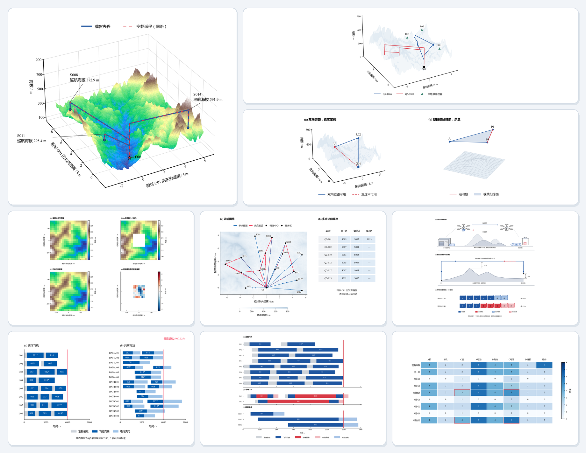
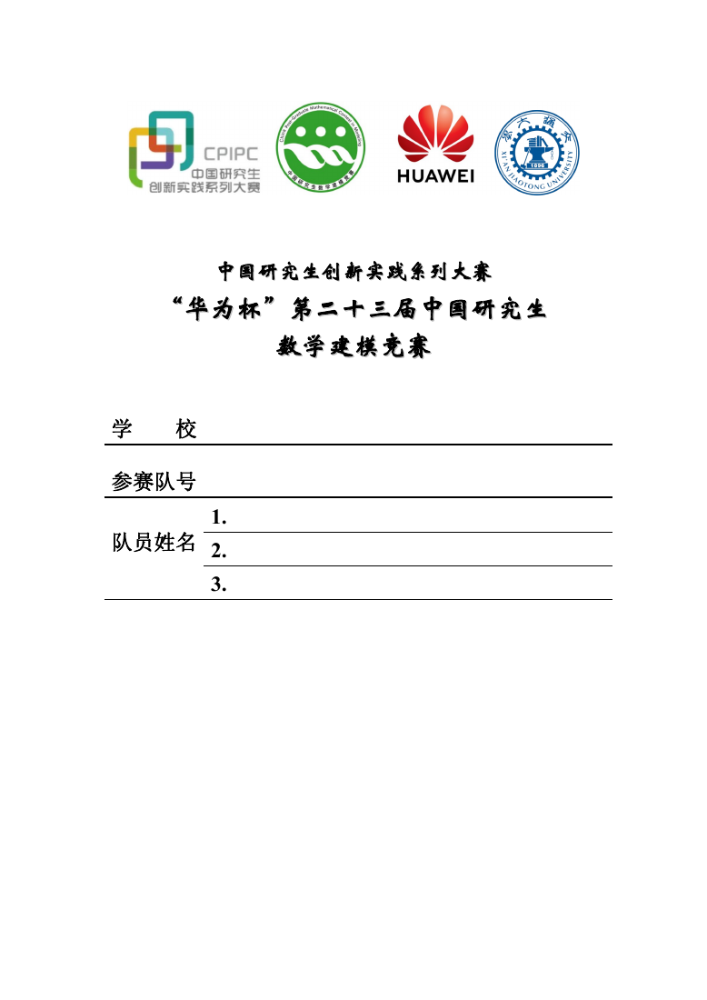
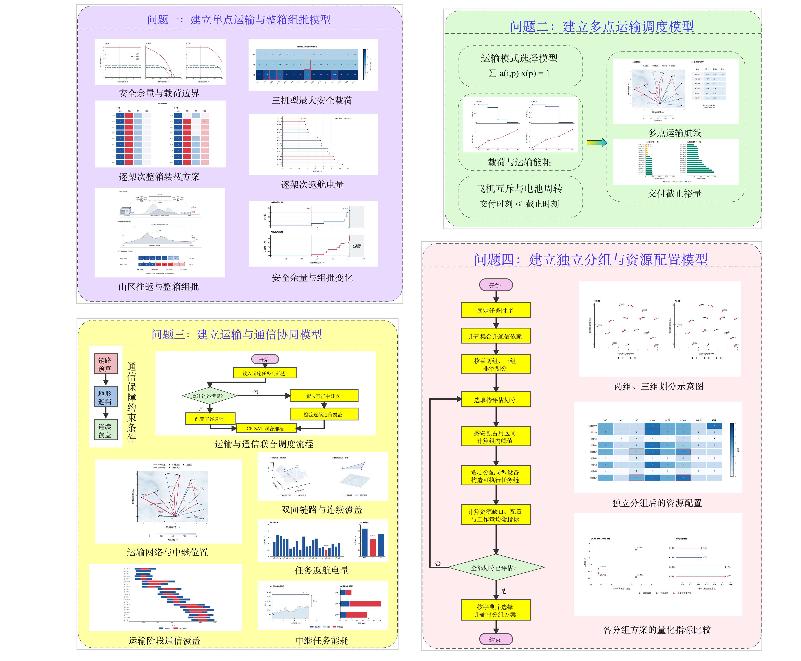

# 华为杯数学建模

> 这里放着我们参加华为杯时用过的 LaTeX 论文模板、绘图示例和 Skills。

从论文排版、结果绘图、技术路线图到正文写作与审阅，这个仓库提供可直接使用的模板和工作方法。示例展示做法，写新论文时仍需以自己的赛题、代码和确认的结果为准。

## 🚀 从这里开始

克隆仓库后，可以直接使用 LaTeX 模板。要在 Codex 中调用绘图、路线图和写作 skills，请将三个目录完整复制到个人 skills 目录：

```sh
git clone https://github.com/vitoworleone/huawei-cup-math-modeling-toolkit.git
cd huawei-cup-math-modeling-toolkit
mkdir -p "$HOME/.codex/skills"
cp -R math-modeling-figure math-modeling-roadmap math-modeling-paper-writing "$HOME/.codex/skills/"
```

首次使用时，先提供赛题、已有模型、计算结果和论文草稿，让 Codex 盘点材料与缺口，再进入下面对应的环节。

## 📄 论文模板

适合开始写新论文，或检查封面、摘要、目录、公式、图表和参考文献的排版。目录中保留完整的类文件、字体、页面素材、空白入口和可编译样张。

**使用方法**：在 `latex-paper-template/` 编译样张检查效果，再编译不含赛题正文的 `main.tex`。填写自己的内容后，按当届赛事要求核对封面，并逐页检查字体、图表位置、编号和引用。编译需要 XeLaTeX 或兼容的 Tectonic。

```sh
cd latex-paper-template
bash build.sh
bash build.sh main.tex
```

公式、插图和三线表的写法，以及页面规范，都收在模板目录中。**[进入完整论文模板 →](latex-paper-template/README.md)**

## 📊 科学图件

适合已有数据或模型结果，需要决定画什么、如何画，以及图件放进论文后是否清楚。先确定每张图的论证作用、数据来源、变量单位和插入宽度，再选图型和绘制。

在 Codex 中可以这样开始：

```text
使用 $math-modeling-figure。依据我提供的结果文件和论文第 4 章，
先列出每张图的论证作用、数据来源、变量单位和插入宽度，
再绘图并检查图号、图注、数值和纸面可读性。
```

目录内有图件计划表、Matplotlib 起点、七张成品图和 AI 审计记录方法。交付时按实际插入尺寸检查，并保留 PNG、PDF、SVG 及数据来源记录。**[查看绘图方法与示例 →](math-modeling-figure/README.md)**

## 🧭 技术路线图

适合说明各问如何衔接，以及每一问的方法、结果和证据之间的关系。先列出各问的输入与输出，特别标明哪些条件传给下一问、哪些决策需要重新求解，再组织画布。

```text
使用 $math-modeling-roadmap。依据当前正文和已确认结果，
先列出各问的输入、方法、结果证据及跨问接口，再制作总体技术路线图。
请保存可编辑源文件和预览图，并按论文插入宽度审查；
看不清或与正文不符的部分继续修改。
```

已配置 Excalidraw MCP 时，可以按目录中的操作流程迭代画布。第三版成品路线图可作为布局和审阅参照，交付自己的论文时保留可编辑源文件和预览图。**[查看路线图方法与示例 →](math-modeling-roadmap/README.md)**

## ✍️ 正文写作与审阅

适合讨论章节结构、起草正文、核查论证或按意见修订。先提供赛题、确认的模型与计算结果、相关图表和现有草稿，并说明这次要完成哪一步。材料不足时先标出缺口。

```text
使用 $math-modeling-paper-writing。依据我提供的赛题、已确认的模型、
计算结果和图表，先梳理第 3 章各节的职责与前后衔接，
再写可审阅的正文初稿。对缺少证据的数字和结论标明待核实。
```

如果只要审查意见，可以明确说“只审阅第 3 章，不改写正文”，并要求按位置、依据、影响和改法列出问题。修订后再核对摘要、参考文献用途与跨章术语。**[查看写作 skill 与审阅流程 →](math-modeling-paper-writing/README.md)**

## 🖼️ 成品预览

### 正文图件



### 论文排版



可查看 [完整排版 PDF](latex-paper-template/preview/sample.pdf) 和 [正文写作模板 PDF](showcase/writing-template-example.pdf)。

### 总体技术路线图



## ⭐ Star History

<p align="center">
  <a href="https://www.star-history.com/#vitoworleone/huawei-cup-math-modeling-toolkit&Date"></a>
</p>

## 📜 许可

原创代码和文档采用 [MIT License](LICENSE)。成品图件、字体和赛事页面素材等的使用范围见 [NOTICE.md](NOTICE.md)。本项目不包含完整赛题论文，与赛事主办方无官方关联。
