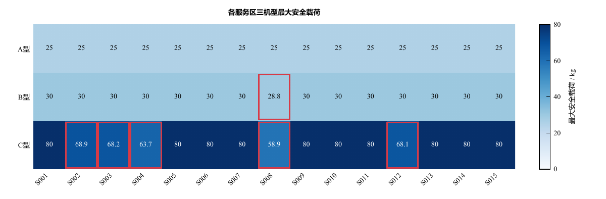
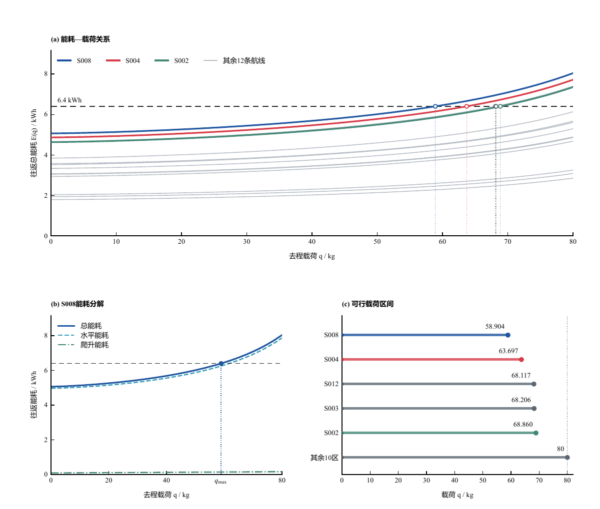
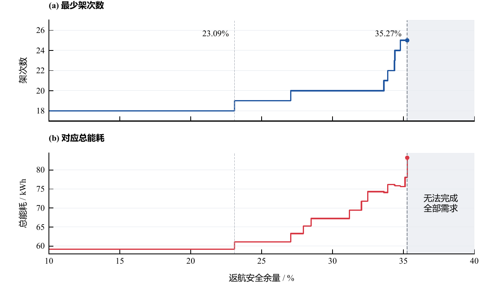
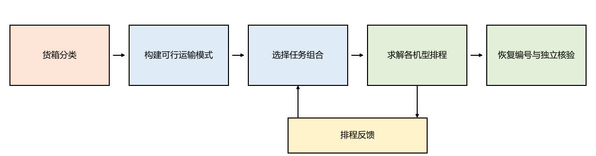
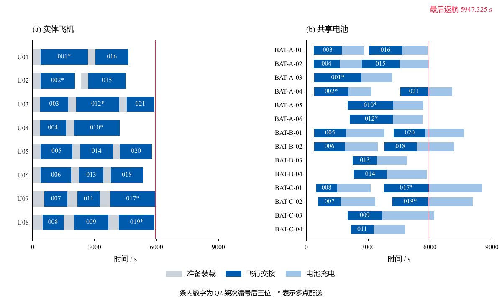
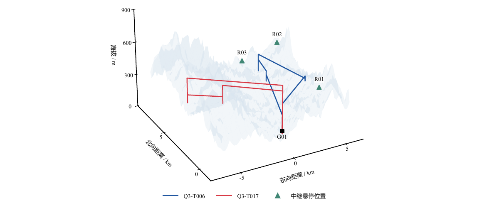
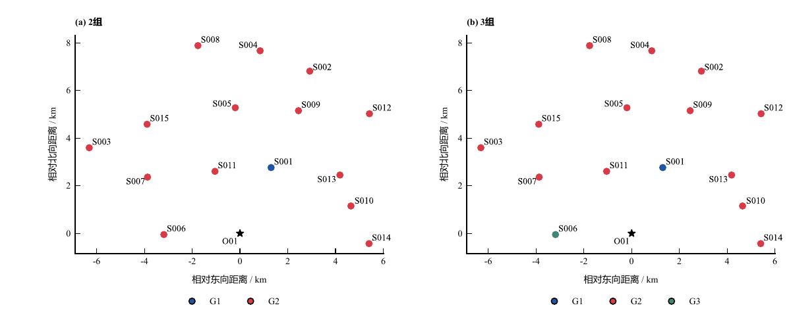

# 成品论文图件示例

以下七张 PDF 均来自 `draft/D题/figures/`，已逐项核对 `draft/D题/sections/ch4.tex` 至 `ch7.tex` 的实际 `\paperfigure` 引用、图题和插入宽度。PNG 是从这些 PDF 渲染的浏览预览；PDF 是论文使用的图件。选择不同论证任务各取一例，供新论文参考结构、视觉层级和图注分工。这里的数值、地点与方案仅属于本次 D 题。

| 论文图号 | 图型 | 成稿宽度 | 可借鉴的做法 | PDF |
|---|---|---:|---|---|
| 4-4 | 矩阵热图 | 160 mm | 色标与格内数字同为 kg，红框另标受限组合 | [打开](04-04_heatmap.pdf) |
| 4-5 | 约束曲线与多面板 | 160 mm | 主曲线、约束线、分解与可行区间各承担一层证据 | [打开](04-05_feasibility.pdf) |
| 4-7 | 离散阶梯 | 120 mm | 精确阈值、端点和不可行区间分开表达 | [打开](04-07_step.pdf) |
| 5-2 | 方法流程框图 | 160 mm | 直角框和淡色分工，反馈箭头保持清晰 | [打开](05-02_flow.pdf) |
| 5-5 | 资源甘特图 | 160 mm | 飞机与共享电池共用时间轴，准备、飞行、充电分色 | [打开](05-05_schedule.pdf) |
| 6-6 | 三维地形与航迹 | 145 mm | 地形作空间背景，实际航迹和中继点保持醒目 | [打开](06-06_terrain_3d.pdf) |
| 7-2 | 空间分组对比 | 160 mm | 两方案使用同一坐标尺度，不虚构地理边界 | [打开](07-02_groups.pdf) |

## 图 4-4：矩阵热图

图中颜色和数字都表示最大安全载荷；色条标明 kg，红框只传达另一层受限状态。复用时先确认矩阵中零、缺失和不可行的区别，再设置色标范围。原图集编号 Q1_02。

## 图 4-5：约束曲线与多面板

上方面板交代不同航线的能耗随载荷变化，虚线为预算；下方分解一个代表例子并列出可行载荷区间。多面板共享一条论证链，避免将全部数值重复写进图内。原图集编号 Q1_03。

## 图 4-7：离散阶梯

架次数是离散量，用阶梯保持真实跳变；两条竖线和末端点标识关键阈值，灰底表示无法完成全部需求。精确阈值与端点是否可取由图注或正文给出。原图集编号 Q1_06。

## 图 5-2：方法流程框图

白底、黑色直角框和箭头构成主路径，淡色只区分步骤角色；下方反馈回到任务组合选择，箭头不穿过文字。框图概括方法步骤，具体算法依据和反馈含义由正文说明。原图集编号 Q2_B03。

## 图 5-5：资源甘特图

左右面板共用秒轴：左侧是实体飞机，右侧是共享电池；任务标签放在条内，图例解释阶段颜色。最后返航线之后仍保留充电条，避免将“返航完成”误读为所有资源可复用。原图集编号 Q2_F03。

## 图 6-6：三维地形与航迹

地形使用淡色背景，两条代表航迹和中继点以线型、颜色、形状区分。三维图用于交代空间相对位置；定量航程、高度或约束应回到结果、剖面或表格核验。原图集编号 Q3_B05。

## 图 7-2：空间分组对比

两幅子图使用同一东西/南北坐标尺度，颜色表示组别，点位不动。分组不要求地理连续，因此不添加虚构分区边界。原图集编号 Q4_F02。

`manifest.json` 记录每个 PDF 的原工程路径与 SHA-256，便于核对。原工程的绘图源码、冻结数据和完整审阅记录未复制到此示例目录；`assets/plot_template.py` 是另一个用虚构数据演示的可运行起点。
